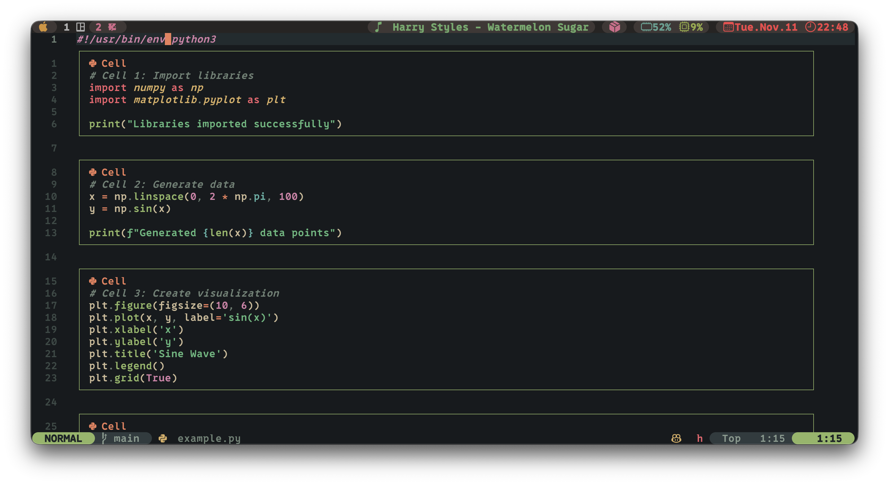

# notebook_style.nvim

A Neovim plugin that renders Python file cells (separated by `# %%` delimiters) with beautiful, customizable borders. Perfect for working with Jupyter-style Python files in Neovim.


## Features

- **Visual Cell Borders**: Cells are enclosed with solid, dashed, or double borders on all sides
- **Smart Visibility**:
  - Hides `# %%` delimiters in normal and visual modes (shows subtle cell marker)
  - Hides cell borders in insert mode for distraction-free editing
- **Fully Customizable**: Colors, border styles, and behavior can be configured
- **Non-intrusive**: Borders don't obscure code and automatically adjust to window width
- **Lightweight**: Uses Neovim's native extmarks for efficient rendering

## Installation

### Using [lazy.nvim](https://github.com/folke/lazy.nvim)

```lua
{
  'stellarjmr/notebook_style.nvim',
  ft = 'python',  -- Load only for Python files
  opts = {},
}
```

### Using [packer.nvim](https://github.com/wbthomason/packer.nvim)

```lua
use {
  'stellarjmr/notebook_style.nvim',
  ft = 'python',
  config = function()
    require('notebook_style').setup()
  end
}
```

### Using [vim-plug](https://github.com/junegunn/vim-plug)

```vim
Plug 'stellarjmr/notebook_style.nvim'

" In your init.vim or after plug#end()
lua << EOF
require('notebook_style').setup()
EOF
```

## Usage

The plugin automatically activates for Python files when you have `# %%` cell delimiters.

### Cell Delimiter Format

```python
# %%
# This is the first cell
import numpy as np
print("Hello from cell 1")

# %%
# This is the second cell
def my_function():
    return 42

result = my_function()
print(result)
```

### Commands

- `:NotebookStyleEnable` - Enable the plugin for current buffer
- `:NotebookStyleDisable` - Disable the plugin for current buffer
- `:NotebookStyleToggle` - Toggle the plugin for current buffer
- `:NotebookStyleRender` - Manually render cells (useful with `manual_render` option)
- `:NotebookStyleToggleRender` - Toggle cell rendering on/off (useful with `manual_render` option)

### Readability Tips

- The boundary lines of the first and last rows may be hidden by the buffer. Scroll to the top/bottom of the page to display them.

## Configuration

Default configuration:

```lua
require('notebook_style').setup({
  -- Cell delimiter pattern (Lua pattern)
  cell_delimiter = "^#%s*%%%%",

  -- Border style: 'solid', 'dashed', or 'double'
  border_style = 'solid',

  -- Colors (hex colors or highlight group names)
  colors = {
    border = '#6272A4',      -- Border color
    delimiter = '#50FA7B',   -- Delimiter marker color
  },

  -- Visibility options
  hide_delimiter = true,           -- Hide # %% in normal/visual modes
  hide_border_in_insert = true,    -- Hide borders in insert mode
  manual_render = false,           -- If true, cells only render on <leader>rs

  -- Cell marker (shown when delimiter is hidden)
  cell_marker = ' Cell',        --  is Python nerd font icon

  -- Cell width configuration
  cell_width_percentage = 80,      -- Cell width as % of window width (1-100)
  min_cell_width = 40,             -- Minimum cell width in characters
  max_cell_width = 120,            -- Maximum cell width in characters

  -- Filetypes to enable the plugin for
  filetypes = { 'python' },
})
```

### Manual Rendering Mode

By default, cells render automatically as you type and move around. For better performance or more control, you can enable manual rendering:

```lua
require('notebook_style').setup({
  manual_render = true,  -- Cells won't render automatically
})
```

With manual rendering enabled:
- Cells don't render automatically on text changes
- Press `<leader>rs` to toggle cell rendering on/off
- Mode changes (insert/normal) still work correctly
- Use `:NotebookStyleToggleRender` command as an alternative

**Keybinding**: The plugin automatically sets up `<leader>rs` for toggling. You can customize it:

```lua
-- After setup, override the default keybinding
vim.keymap.set('n', '<leader>nc', '<cmd>NotebookStyleToggleRender<cr>', { desc = 'Toggle cell rendering' })
```

### Custom Border Styles

You can define custom border characters:

```lua
require('notebook_style').setup({
  border_style = 'solid',  -- or 'dashed', 'double'

  -- You can also override border characters directly
  border_chars = {
    solid = {
      top_left = '┌',
      top_right = '┐',
      bottom_left = '└',
      bottom_right = '┘',
      horizontal = '─',
      vertical = '│',
    },
    -- Custom style
    my_style = {
      top_left = '╭',
      top_right = '╮',
      bottom_left = '╰',
      bottom_right = '╯',
      horizontal = '─',
      vertical = '│',
    },
  },
})
```

### Color Customization

You can use hex colors or link to existing highlight groups:

```lua
require('notebook_style').setup({
  colors = {
    border = '#FF79C6',        -- Pink borders
    delimiter = '#8BE9FD',     -- Cyan delimiter marker
  },
})
```

Or link to your colorscheme:

```lua
-- In your config, after setting up the plugin
vim.api.nvim_set_hl(0, 'NotebookCellBorder', { link = 'Comment' })
vim.api.nvim_set_hl(0, 'NotebookCellDelimiter', { link = 'Special' })
```

### Cell Width Configuration

Control how wide cells appear in your buffer:

```lua
require('notebook_style').setup({
  cell_width_percentage = 80,  -- Use 80% of window width
  min_cell_width = 40,         -- Never smaller than 40 chars
  max_cell_width = 120,        -- Never larger than 120 chars
})
```

**Tips**:
- **Narrow cells** (60-70%): Better for wide windows, easier to read
- **Wide cells** (90-95%): Better for narrow windows, maximize space
- **Default** (80%): Good balance for most use cases

### Cell Marker Customization

Customize the text shown when `# %%` delimiters are hidden:

```lua
require('notebook_style').setup({
  -- With Python nerd font icon (default, requires a Nerd Font)
  cell_marker = ' Cell',  --  is the Python icon

  -- Or use other icons/text
  cell_marker = '📘 Cell',          -- Book emoji
  cell_marker = '▶ Cell',           -- Play icon
  cell_marker = '# Cell',           -- Simple hash
  cell_marker = '',                 -- Just the Python icon
})
```

**Note**: Nerd font icons require a [Nerd Font](https://www.nerdfonts.com/) to be installed and set as your terminal font.

### Example Configurations

**Minimal setup** (use defaults):
```lua
require('notebook_style').setup()
```

**Dracula theme colors**:
```lua
require('notebook_style').setup({
  border_style = 'dashed',
  colors = {
    border = '#6272A4',
    delimiter = '#50FA7B',
  },
})
```

**Gruvbox theme colors**:
```lua
require('notebook_style').setup({
  border_style = 'solid',
  colors = {
    border = '#928374',
    delimiter = '#b8bb26',
  },
})
```

## How It Works

The plugin uses Neovim's extmarks API to render virtual text for borders without modifying the actual buffer content. This means:

- Your file remains unchanged
- Borders are visual only and don't affect formatting
- No performance impact on large files
- Works seamlessly with other plugins

## Keybindings (Optional)

You can add custom keybindings for quick toggling:

```lua
vim.keymap.set('n', '<leader>ns', '<cmd>NotebookStyleToggle<cr>', { desc = 'Toggle notebook style' })
```

## Requirements

- Neovim >= 0.8.0
- A font that supports Unicode box-drawing characters (most modern terminal fonts)

## Similar Projects

- [jupytext.nvim](https://github.com/GCBallesteros/jupytext.nvim) - Edit Jupyter notebooks in Neovim
- [magma-nvim](https://github.com/dccsillag/magma-nvim) - Interactive code evaluation

## License

MIT License

## Contributing

Contributions are welcome! Please feel free to submit issues or pull requests.
