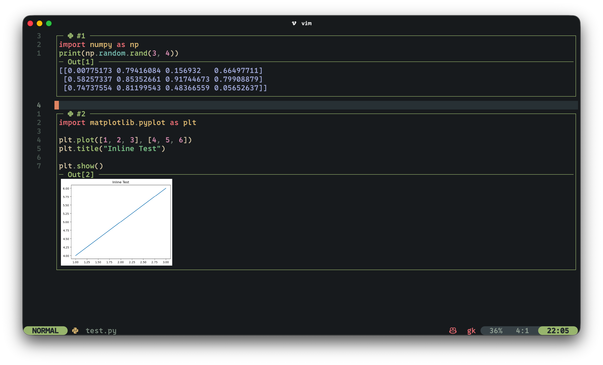

# notebook_style.nvim

A Neovim plugin that renders Python file cells (separated by `# %%` delimiters) with beautiful, customizable borders. Perfect for working with Jupyter-style Python files in Neovim.


## Features

- **Visual Cell Borders**: Cells are enclosed with solid, dashed, or double borders on all sides
- **Cell Names**: Display custom cell names from delimiters (e.g., `# %% My Cell Name`)
- **Smart Visibility**:
  - Hides `# %%` delimiters in normal and visual modes (shows subtle cell marker)
  - Hides cell borders in insert mode for distraction-free editing
- **Fully Customizable**: Colors, border styles, and behavior can be configured
- **Non-intrusive**: Borders don't obscure code and automatically adjust to window width
- **Lightweight**: Uses Neovim's native extmarks for efficient rendering
- **Inline Cell Execution (experimental)**: Run Python cells through a Rust Jupyter backend and render text outputs inline
- **Notebook Workflow**: Works with `.ipynb` notebooks when Jupytext exposes them as `# %%` Python buffers

## Installation

The core cell-border rendering works with a normal plugin install. Inline execution needs the optional Rust backend; install it with your plugin manager hook or by running `:NotebookStyleDownloadBackend`.

### Using [lazy.nvim](https://github.com/folke/lazy.nvim)

Render-only setup:

```lua
{
  'stellarjmr/notebook_style.nvim',
  ft = 'python',  -- Load only for Python files
  opts = {},
}
```

With the inline execution backend installer:

```lua
{
  'stellarjmr/notebook_style.nvim',
  version = 'v0.5.0',
  ft = 'python',
  build = function(plugin)
    local install = loadfile(plugin.dir .. '/lua/notebook_style/install.lua')()
    install.run(plugin)
  end,
  opts = {},
}
```

### Using `vim.pack` (Neovim 0.12+)

Render-only setup:

```lua
vim.pack.add({
  { src = 'https://github.com/stellarjmr/notebook_style.nvim' },
})

require('notebook_style').setup({})
```

With the inline execution backend installer, define the `PackChanged` hook before `vim.pack.add()`:

```lua
local plugin_name = 'notebook_style.nvim'

vim.api.nvim_create_autocmd('PackChanged', {
  callback = function(event)
    local data = event.data or {}
    local spec = data.spec or {}
    if spec.name ~= plugin_name then
      return
    end
    if data.kind ~= 'install' and data.kind ~= 'update' then
      return
    end

    local install = loadfile(data.path .. '/lua/notebook_style/install.lua')()
    install.run({ dir = data.path })
  end,
})

vim.pack.add({
  { src = 'https://github.com/stellarjmr/notebook_style.nvim', name = plugin_name, version = 'v0.5.0' },
})

require('notebook_style').setup({})
```

### Using [packer.nvim](https://github.com/wbthomason/packer.nvim)

```lua
use {
  'stellarjmr/notebook_style.nvim',
  ft = 'python',
  config = function()
    require('notebook_style').setup()
  end
}
```

### Using [vim-plug](https://github.com/junegunn/vim-plug)

```vim
Plug 'stellarjmr/notebook_style.nvim'

" In your init.vim or after plug#end()
lua << EOF
require('notebook_style').setup()
EOF
```

## Usage

The plugin automatically activates for Python files when you have `# %%` cell delimiters.

### `.ipynb` Notebooks

`.ipynb` notebooks are supported when you install and configure [Jupytext](https://jupytext.readthedocs.io/) so Neovim edits the notebook as percent-style Python with `# %%` cell delimiters. notebook_style.nvim works on that Python buffer and does not parse raw `.ipynb` JSON directly.

If your Jupytext integration uses a filetype other than `python`, add that filetype to `filetypes` in `setup()`.

### Cell Delimiter Format

```python
# %% Data Loading
# This cell loads and prepares data
import numpy as np
print("Hello from cell 1")

# %% Processing
# This cell processes the data
def my_function():
    return 42

result = my_function()
print(result)

# %%
# Cells without names work too
print("Unnamed cell")
```

Cell names (text after `# %%`) are automatically extracted and displayed in the cell marker.

### Commands

- `:NotebookStyleEnable` - Enable the plugin for current buffer
- `:NotebookStyleDisable` - Disable the plugin for current buffer
- `:NotebookStyleToggle` - Toggle the plugin for current buffer
- `:NotebookStyleRender` - Show/re-render cells for the current buffer
- `:NotebookStyleToggleRender` - Toggle cell rendering visibility on/off
- `:NotebookStyleRunCell` - Run the current Python cell and render output inline
- `:NotebookStyleRunFile` - Run all Python cells in the current buffer
- `:NotebookStyleRunCellAndMove` - Run the current cell and move to the next cell
- `:NotebookStyleKernelStart` - Start the Python Jupyter kernel for the current buffer
- `:NotebookStyleKernelStop` - Stop the Python Jupyter kernel for the current buffer
- `:NotebookStyleDownloadBackend` - Download the prebuilt backend for this release, or fall back to building from source

### Inline Execution Backend

Inline execution is experimental and supports Python buffers with `# %%` cells, including `.py` files and `.ipynb` notebooks opened through Jupytext. On tagged releases, the install hooks above download a prebuilt `notebook-style-core` backend for supported platforms, so normal users do not need a Rust toolchain.

Supported prebuilt targets:
- `aarch64-apple-darwin` (Apple Silicon macOS)
- `x86_64-unknown-linux-gnu` (Linux x86_64)
- `aarch64-unknown-linux-gnu` (Linux ARM64)

Development branches, unsupported platforms, or failed downloads fall back to a local Cargo build:

```sh
cargo build --release --manifest-path core/Cargo.toml
```

Run `:NotebookStyleDownloadBackend` after install/update if your plugin manager did not run the hook or you need to retry backend installation. The downloaded or built binary is stored at `core/target/release/notebook-style-core`; `backend_cmd` can still override this path.

Then run `:NotebookStyleRunCell` inside a cell. The plugin starts a Python Jupyter kernel on demand, sends the current cell source to the kernel, and renders stdout, `text/plain` results, errors, and `image/png` outputs below the cell. In Ghostty/Kitty, PNG outputs use the Kitty graphics protocol; unsupported terminals fall back to `[image/png output]` text.

By default, `auto_venv = true` makes kernel startup prefer a project-local `.venv`: notebook_style.nvim walks up from the current file's directory, looks for `.venv/bin/python` (or `.venv/Scripts/python.exe` on Windows), and uses it directly when it can import `ipykernel`. This avoids registering a Jupyter kernelspec for every project. If a local `.venv` exists but cannot import `ipykernel`, install it with that environment's Python (for example, `.venv/bin/python -m pip install ipykernel`) or set `auto_venv = false` to always use `kernel_name`.

When running inside tmux, enable graphics passthrough in tmux:

```tmux
set -g allow-passthrough on
```

The plugin wraps Kitty graphics escapes automatically when `TMUX` is set. If you need to opt out, set `NOTEBOOK_STYLE_DISABLE_TMUX_PASSTHROUGH=1`.

PNG outputs are rendered with Kitty Unicode placeholders. `image.cols` is treated as a maximum width: notebook_style.nvim reads the PNG dimensions and narrows the virtual placement when needed so terminals do not center normal plot images inside an over-wide placeholder box. If your terminal font has an unusual cell shape, adjust `image.cell_height_to_width`.

### Readability Tips

- The boundary lines of the first and last rows may be hidden by the buffer. Scroll to the top/bottom of the page to display them.

## Configuration

Default configuration:

```lua
require('notebook_style').setup({
  -- Cell delimiter pattern (Lua pattern)
  cell_delimiter = "^#%s*%%%%",

  -- Border style: 'solid', 'dashed', or 'double'
  border_style = 'solid',

  -- Colors (hex colors or highlight group names)
  colors = {
    border = '#6272A4',      -- Border color
    delimiter = '#50FA7B',   -- Delimiter marker color
    output = '#A9B1D6',      -- Inline stdout/stderr color
    result = '#C0CAF5',      -- Inline result color
    error = '#F7768E',       -- Inline error color
  },

  -- Visibility options
  hide_delimiter = true,           -- Hide # %% in normal/visual modes
  hide_border_in_insert = true,    -- Hide borders in insert mode
  manual_render = false,           -- If true, start hidden and render on demand

  -- Cell marker (shown when delimiter is hidden)
  cell_marker = ' ',              -- Python nerd font icon

  -- Cell name display options
  show_cell_name = true,           -- Show cell name from delimiter (e.g., "# %% My Cell")
  show_cell_number = true,         -- Show cell number in the label
  cell_name_pattern = '^#%s*%%%%%s*(.-)%s*$',  -- Pattern to extract cell name
  cell_name_max_length = 40,       -- Max length for cell name (nil to disable)
  cell_label_format_named = '{icon}#{number} {name}',    -- Format with name
  cell_label_format_unnamed = '{icon}#{number}',         -- Format without name

  -- Legacy cell width configuration. Borders now use the full window text area
  -- for stable wrapped-line rendering; these are accepted for compatibility.
  cell_width_percentage = 80,      -- Cell width as % of window width (1-100)
  min_cell_width = 40,             -- Minimum cell width in characters
  max_cell_width = 120,            -- Maximum cell width in characters

  -- Inline execution options
  backend_cmd = nil,               -- Auto-detect core/target/{release,debug}/notebook-style-core
  kernel_name = 'python3',         -- Jupyter kernelspec name
  auto_venv = true,                -- Prefer project-local .venv with ipykernel
  auto_start_kernel = true,        -- Start kernel on first :NotebookStyleRunCell
  output_max_lines = 200,          -- Truncate very large outputs
  image = {
    rows = 18,                     -- Height reserved for image/png outputs
    cols = 60,                     -- Max width reserved for image/png outputs
    cell_height_to_width = 2.0,     -- Approximate terminal cell pixel ratio
  },

  -- Default keymaps. Set a mapping to false to disable it.
  keymaps = {
    toggle_render = '<leader>rs',
    run_cell = '<leader>rr',
    run_file = '<leader>rf',
    run_cell_and_move = '<leader>rn',
  },

  -- Filetypes to enable the plugin for
  filetypes = { 'python' },
})
```

### Manual Rendering Mode

By default, cells render automatically as you type and move around. For better performance or more control, you can enable manual rendering:

```lua
require('notebook_style').setup({
  manual_render = true,  -- Start hidden and render on demand
})
```

With manual rendering enabled:
- Cells start hidden and don't render automatically on text changes
- Press `<leader>rs` to show cell rendering; press it again to hide rendering
- Mode changes (insert/normal) still work correctly
- Use `:NotebookStyleToggleRender` command as an alternative

With the default `manual_render = false`, cells render automatically when a Python buffer opens. In this mode, `<leader>rs` hides the current rendering and keeps it hidden until you toggle it back on or run `:NotebookStyleRender`.

**Keybindings**: The plugin automatically sets up `<leader>rs` for toggling, `<leader>rr` for running the current cell, `<leader>rf` for running all cells, and `<leader>rn` for running the current cell and moving to the next cell. You can customize or disable them:

```lua
require('notebook_style').setup({
  keymaps = {
    toggle_render = '<leader>nc',
    run_cell = '<leader>rr',
    run_file = '<leader>rf',
    run_cell_and_move = false,
  },
})
```

### Custom Border Styles

You can define custom border characters:

```lua
require('notebook_style').setup({
  border_style = 'solid',  -- or 'dashed', 'double'

  -- You can also override border characters directly
  border_chars = {
    solid = {
      top_left = '┌',
      top_right = '┐',
      bottom_left = '└',
      bottom_right = '┘',
      horizontal = '─',
      vertical = '│',
    },
    -- Custom style
    my_style = {
      top_left = '╭',
      top_right = '╮',
      bottom_left = '╰',
      bottom_right = '╯',
      horizontal = '─',
      vertical = '│',
    },
  },
})
```

### Color Customization

You can use hex colors or link to existing highlight groups:

```lua
require('notebook_style').setup({
  colors = {
    border = '#FF79C6',        -- Pink borders
    delimiter = '#8BE9FD',     -- Cyan delimiter marker
  },
})
```

Or link to your colorscheme:

```lua
-- In your config, after setting up the plugin
vim.api.nvim_set_hl(0, 'NotebookCellBorder', { link = 'Comment' })
vim.api.nvim_set_hl(0, 'NotebookCellDelimiter', { link = 'Special' })
```

### Cell Width Configuration

Control how wide cells appear in your buffer:

```lua
require('notebook_style').setup({
  cell_width_percentage = 80,  -- Use 80% of window width
  min_cell_width = 40,         -- Never smaller than 40 chars
  max_cell_width = 120,        -- Never larger than 120 chars
})
```

**Tips**:
- **Narrow cells** (60-70%): Better for wide windows, easier to read
- **Wide cells** (90-95%): Better for narrow windows, maximize space
- **Default** (80%): Good balance for most use cases

### Cell Marker Customization

Customize the text shown when `# %%` delimiters are hidden:

```lua
require('notebook_style').setup({
  -- With Python nerd font icon (default, requires a Nerd Font)
  cell_marker = ' Cell',  --  is the Python icon

  -- Or use other icons/text
  cell_marker = '📘 Cell',          -- Book emoji
  cell_marker = '▶ Cell',           -- Play icon
  cell_marker = '# Cell',           -- Simple hash
  cell_marker = '',                 -- Just the Python icon
})
```

**Note**: Nerd font icons require a [Nerd Font](https://www.nerdfonts.com/) to be installed and set as your terminal font.

### Example Configurations

**Minimal setup** (use defaults):
```lua
require('notebook_style').setup()
```

**Dracula theme colors**:
```lua
require('notebook_style').setup({
  border_style = 'dashed',
  colors = {
    border = '#6272A4',
    delimiter = '#50FA7B',
  },
})
```

**Gruvbox theme colors**:
```lua
require('notebook_style').setup({
  border_style = 'solid',
  colors = {
    border = '#928374',
    delimiter = '#b8bb26',
  },
})
```

## How It Works

The plugin uses Neovim's extmarks API to render virtual text for borders without modifying the actual buffer content. This means:

- Your file remains unchanged
- Borders are visual only and don't affect formatting
- No performance impact on large files
- Works seamlessly with other plugins

## Keybindings (Optional)

You can add custom keybindings for quick toggling:

```lua
vim.keymap.set('n', '<leader>ns', '<cmd>NotebookStyleToggle<cr>', { desc = 'Toggle notebook style' })
```

## Requirements

- Neovim >= 0.8.0
- A font that supports Unicode box-drawing characters (most modern terminal fonts)
- Jupytext if you want to edit `.ipynb` notebooks as `# %%` Python buffers

## Development Tests

Run the focused local test suite with:

```sh
tests/run_all.sh
```

This checks Rust formatting, runs `cargo test`, builds the release backend, and runs headless Neovim Lua smoke tests. The Lua suite also exercises `auto_venv` when `python3` can import `ipykernel`; otherwise that integration check is reported as skipped.

## Similar Projects

- [jupytext.nvim](https://github.com/GCBallesteros/jupytext.nvim) - Edit Jupyter notebooks in Neovim
- [magma-nvim](https://github.com/dccsillag/magma-nvim) - Interactive code evaluation

## License

MIT License

## Contributing

Contributions are welcome! Please feel free to submit issues or pull requests.
